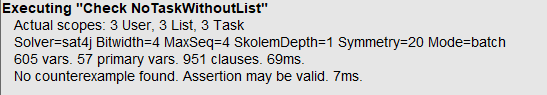
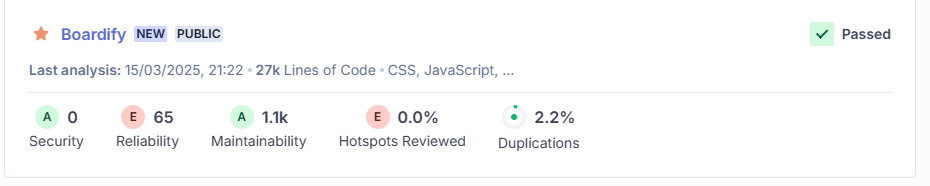
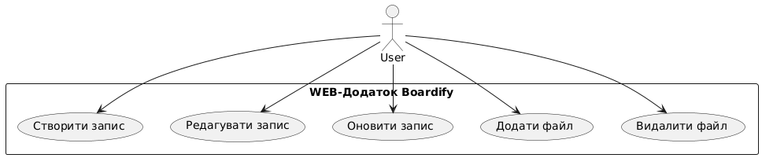
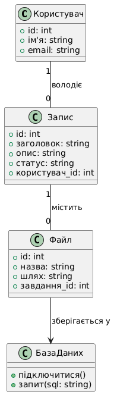
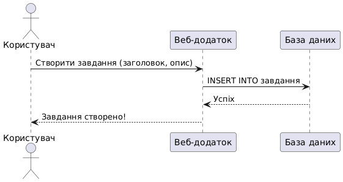
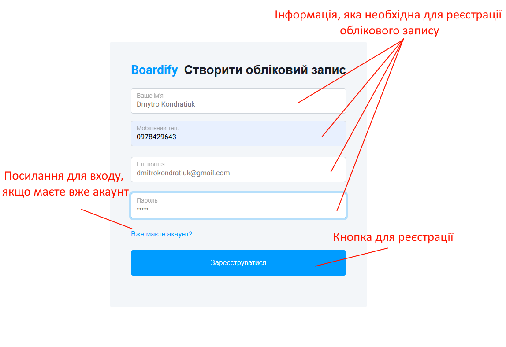
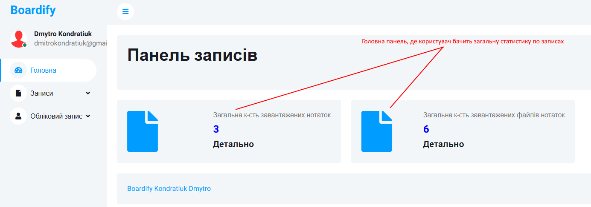
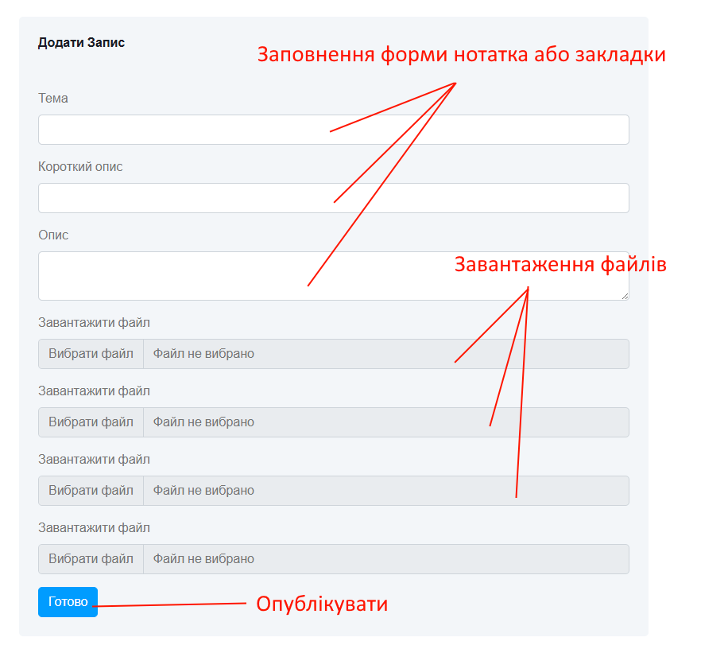
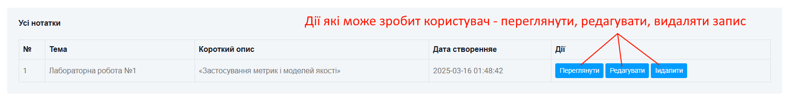
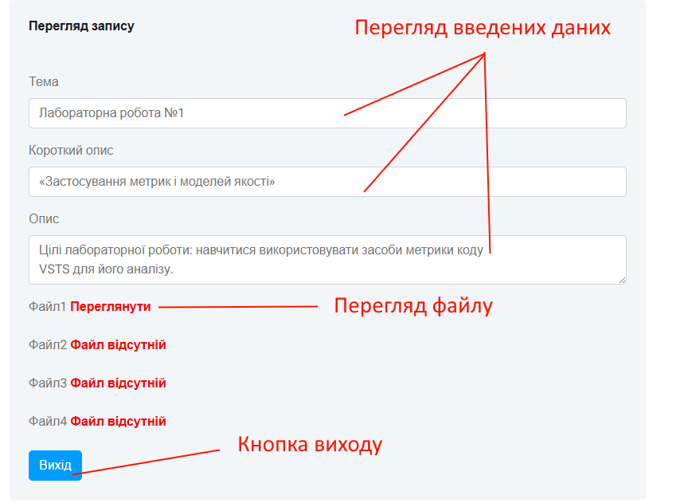

# Проєкт 1 - Web-додаток «Boardify»

## Опис
Web-додаток «Boardify» розроблений для управління задачами (аналог Trello). Дозволяє створювати, редагувати та переміщати задачі між списками.

## Модель якості веб-додатка

### Вступ
Модель якості визначає основні характеристики та метрики для оцінки веб-додатка відповідно до стандартів **ISO/IEC 25010** та **ISO/IEC 25019:2023**.

### Характеристики якості згідно ISO/IEC 25010

#### **Функціональна придатність**
- **Коректність виконання CRUD-операцій** із задачами.
  - *Наприклад: Усі CRUD-операції працюють для кожного типу завдань.*
- **Відповідність бізнес-логіки вимогам користувачів.**
  - *Наприклад: Завдання переходить у стан "виконано" тільки після зміни статусу користувачем.*

#### **Продуктивність**
- **Час відгуку сервера при виконанні основних операцій.**
  - *Наприклад: Відповідь API не повинна перевищувати 200 мс.*
- **Оптимізація запитів до бази даних.**
  - *Наприклад: Використання RAM не повинно перевищувати 500 МБ при 100 активних користувачах.*

#### **Безпека**
- **Коректна автентифікація та управління сесіями.**
  - *Наприклад: Двофакторна автентифікація для адміністраторів.*

#### **Зручність використання**
- **Інтуїтивний інтерфейс для роботи із задачами.**
  - *Наприклад: Користувач може створити нову задачу без попереднього навчання.*
- **Наявність адаптивного дизайну.**
  - *Наприклад: Створення нової задачі займає не більше 3 кліків.*

#### **Якість коду**
- **Відповідність стандартам PSR для PHP.**
- **Аналіз коду за допомогою PHPStan та SonarQube.**

### Ключові метрики якості коду
- **Чистота коду**: Відсутність дублікатів, зайвих залежностей.
- **Покриття тестами**: Частка коду, перевірена модульними тестами.
- **Кількість виявлених дефектів**: Аналіз через статичні аналізатори.
- **Час на виправлення помилок**: Середній час, необхідний для усунення багів.
- **Кількість комітів без документації**.

### Базові метрики якості
- Виконано у середовищі **SonarCloud**.

## Формальна верифікація специфікацій
Створено специфікацію обмежень для системи та перевірено її коректність в **Alloy**:


module TaskManagement

// Визначення сутності Користувач (User)
sig User {
    tasks: some Task,  // Кожен користувач має хоча б одну задачу
    lists: some List   // Користувач може мати один або кілька списків задач
}

// Визначення сутності Список (List)
sig List {
    tasks: set Task  // Кожен список містить множину задач
}

// Визначення сутності Завдання (Task)
sig Task {
    list: one List,  // Кожна задача належить лише одному списку
    editors: set User  // Користувачі, які можуть редагувати цю задачу
}

// Обмеження: Кожен користувач повинен мати хоча б одну задачу
fact UserHasTasks {
    all u: User | some u.tasks
}

// Обмеження: Кожна задача повинна належати лише одному списку
fact TaskInOneList {
    all t: Task | one t.list
}

// Обмеження: Користувач може редагувати лише свої власні задачі
fact UserCanEditOwnTasks {
    all u: User, t: Task | (t in u.tasks) => (u in t.editors)
}

// Обмеження: Кожна задача обов'язково має бути у списку
fact TaskHasList {
    all t: Task | some t.list
}

// Перевірка: В системі не може бути задач без списку
check NoTaskWithoutList {
    all t: Task | some t.list
}

// Перевірка: Кожен користувач має хоча б одну задачу
check EachUserHasTask {
    all u: User | some u.tasks
}

// Виконання перевірки на тестовому наборі даних (до 5 елементів)
run {} for 5```

## Результат роботи Alloy



## Аналіз якості коду (SonarCloud)
**Загальні показники**:
- **Розмір коду**: 27k рядків
- **Мови**: CSS, JavaScript, PHP, HTML

**Оцінки якості**:
- 🟢 **Безпека**: 0 вразливостей
- 🔴 **Надійність**: 65 помилок
- 🟢 **Підтримуваність**: 1.1k проблем
- 🔴 **Переглянуті гарячі точки**: 0%
- 🔵 **Дублікація коду**: 2.2%
- 


**Загалом, система відповідає основним вимогам до якості, безпеки та продуктивності. Подальші покращення можуть включати розширення функціональності, оптимізацію продуктивності та впровадження нових методів захисту даних.**

## Верифікація моделей архітектури (PlantUML)
Розроблено UML-діаграми (**випадків використання, класів, послідовності**) та перевірено їх відповідність вимогам.

Діаграма випадків використання

Діаграма класів

Діаграма послідовностей


## Короткий огляд web-застосунку на практиці
Форма входу в систему

Головна форма

Форма створення завдання

Форма дій із формами

Форма перегляду

# Висновок

Розроблений веб-додаток **Boardify** відповідає вимогам управління задачами, надаючи можливість створювати, редагувати та переміщати завдання між списками. Для оцінки його якості було використано **ISO/IEC 25010** та **ISO/IEC 25019:2023**, що дозволило визначити ключові характеристики та метрики.

## Функціональність забезпечує правильне виконання CRUD-операцій, відповідність бізнес-логіці та інтеграцію з базою даних.
## Продуктивність оцінено за допомогою оптимізації запитів та часу відгуку сервера.
## Якість коду перевірена за допомогою **SonarQube**, що дозволило виявити й виправити помилки.
## Формальна верифікація специфікацій у **Alloy** підтвердила коректність ключових обмежень системи.
## Архітектура додатка була змодельована у **PlantUML**, що дало змогу візуалізувати структуру класів, випадків використання та послідовності дій.
## GitHub Actions використано для автоматизації тестування та перевірки коду, що підвищує надійність розробки.

**Загалом, система відповідає основним вимогам до якості, безпеки та продуктивності. Подальші покращення можуть включати розширення функціональності, оптимізацію продуктивності та впровадження нових методів захисту даних.**


