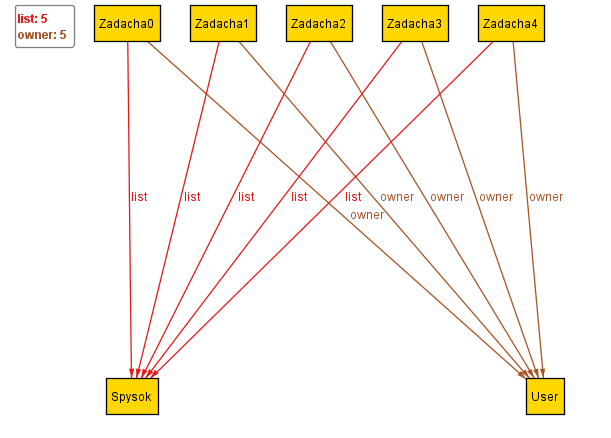

# Проєкт 1 - Web-додаток «Boardify»

## Опис
Web-додаток «Boardify» розроблений для управління задачами (аналог Trello). Дозволяє створювати, редагувати та переміщати задачі між списками.

## Модель якості веб-додатка

### Вступ
Модель якості визначає основні характеристики та метрики для оцінки веб-додатка відповідно до стандартів **ISO/IEC 25010** та **ISO/IEC 25019:2023**.

### Характеристики якості згідно ISO/IEC 25010

#### **Функціональна придатність**
- **Коректність виконання CRUD-операцій** із задачами.
  - *Наприклад: Усі CRUD-операції працюють для кожного типу завдань.*
- **Відповідність бізнес-логіки вимогам користувачів.**
  - *Наприклад: Завдання переходить у стан "виконано" тільки після зміни статусу користувачем.*

#### **Продуктивність**
- **Час відгуку сервера при виконанні основних операцій.**
  - *Наприклад: Відповідь API не повинна перевищувати 200 мс.*
- **Оптимізація запитів до бази даних.**
  - *Наприклад: Використання RAM не повинно перевищувати 500 МБ при 100 активних користувачах.*

#### **Безпека**
- **Коректна автентифікація та управління сесіями.**
  - *Наприклад: Двофакторна автентифікація для адміністраторів.*

#### **Зручність використання**
- **Інтуїтивний інтерфейс для роботи із задачами.**
  - *Наприклад: Користувач може створити нову задачу без попереднього навчання.*
- **Наявність адаптивного дизайну.**
  - *Наприклад: Створення нової задачі займає не більше 3 кліків.*
    
#### **Якість коду**
- **Відповідність стандартам PSR для PHP.**
- **Аналіз коду за допомогою PHPStan та SonarQube.**

### Ключові метрики якості коду
- **Чистота коду**: Відсутність дублікатів, зайвих залежностей.
- **Покриття тестами**: Частка коду, перевірена модульними тестами.
- **Кількість виявлених дефектів**: Аналіз через статичні аналізатори.
- **Час на виправлення помилок**: Середній час, необхідний для усунення багів.
- **Кількість комітів без документації**.

### Базові метрики якості
- Виконано у середовищі **SonarCloud**.

## Формальна верифікація специфікацій
Створено специфікацію обмежень для системи та перевірено її коректність в **Alloy**:

```module TaskManagement

-- Визначення користувача
sig User {}

-- Визначення списку задач
sig Spysok {}

-- Визначення задачі, яка належить до одного списку та має власника
sig Zadacha {
    list: one Spysok,  -- Задача належить рівно одному списку
    owner: one User    -- Власник задачі
}

-- Обмеження для перевірки коректності структури
fact BaseRules {
    all t: Zadacha | one t.list  -- Кожна задача повинна мати список
}

-- Предикат для перегляду екземплярів
pred show {}

-- Запуск моделі для перевірки
run show for 5
```




## Верифікація моделей архітектури (PlantUML)
Розроблено UML-діаграми (**випадків використання, класів, послідовності**) та перевірено їх відповідність вимогам.

Діаграма випадків використання

Діаграма класів

Діаграма послідовностей


## Короткий огляд web-застосунку на практиці
Форма входу в систему

Головна форма

Форма створення завдання

Форма дій із формами

Форма перегляду


